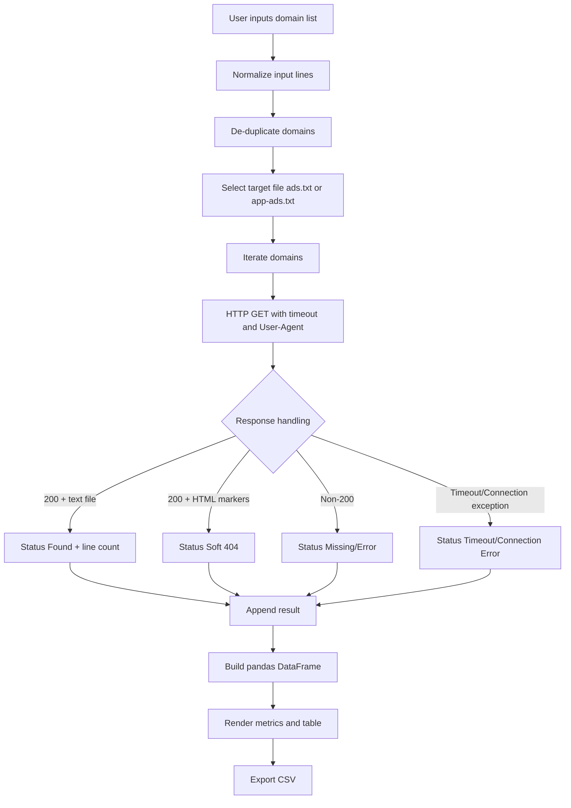

# Bulk Ads.txt Availability Checker

A production-oriented bulk scanning utility for AdOps workflows that verifies the availability and integrity signals of `ads.txt` and `app-ads.txt` endpoints across large domain lists.

[](LICENSE)
[](https://www.python.org/)
[](https://streamlit.io/)
[](https://requests.readthedocs.io/)
[](https://pandas.pydata.org/)

> [!NOTE]
> This project is delivered as a Streamlit application focused on operational scanning and reporting rather than a standalone importable Python package.

## Table of Contents

- [Features](#features)
- [Tech Stack & Architecture](#tech-stack--architecture)
  - [Core Stack](#core-stack)
  - [Project Structure](#project-structure)
  - [Key Design Decisions](#key-design-decisions)
- [Getting Started](#getting-started)
  - [Prerequisites](#prerequisites)
  - [Installation](#installation)
- [Testing](#testing)
- [Deployment](#deployment)
- [Usage](#usage)
- [Configuration](#configuration)
- [License](#license)
- [Contacts & Community Support](#contacts--community-support)

## Features

- Bulk domain ingestion via multi-line textarea input (ideal for Excel/Sheets copy-paste workflows).
- Automated target selection between `ads.txt` and `app-ads.txt` through sidebar radio controls.
- Input sanitization routine that normalizes domains by stripping protocol and path fragments.
- HTTPS endpoint probing with explicit timeout control and hardened browser-like User-Agent headers.
- Soft-404 detection heuristic (flags HTML/body responses even when HTTP status is `200`).
- Response classification into operational categories: `Found`, `Soft 404`, `Missing/Error`, `Timeout`, `Connection Error`, `Error`.
- Line-count extraction for valid text-based ad declaration files.
- Real-time progress visualization for long-running scans with completion counters.
- Results materialization in a pandas-backed tabular report rendered in Streamlit.
- Direct click-through links to scanned target URLs in the UI table.
- CSV export pipeline for downstream QA, BI, or trafficking audits.
- At-a-glance KPI summary metrics: total scanned, files found, missing/errors.
- Built-in de-duplication of domains to reduce redundant network calls.
- Light pacing delay (`time.sleep(0.1)`) to reduce aggressive burst behavior on large scans.

> [!IMPORTANT]
> The scanner currently enforces HTTPS target URLs (for example, `https://example.com/ads.txt`). Domains that only serve files over HTTP may be marked as unavailable.

## Tech Stack & Architecture

### Core Stack

- **Language:** Python 3
- **Web UI Framework:** Streamlit
- **HTTP Client:** Requests
- **Data Processing:** pandas
- **Packaging:** `requirements.txt` for dependency pinning/installation

### Project Structure

```text
.
├── app.py               # Main Streamlit application: UI, scanning logic, reporting/export
├── requirements.txt     # Runtime dependencies
├── LICENSE              # MIT license
└── README.md            # Project documentation
```

### Key Design Decisions

1. **Single-file application architecture (`app.py`)**
   - Minimizes onboarding friction.
   - Optimized for quick operational deployment.

2. **Synchronous scanning model**
   - Simplifies request lifecycle and error handling.
   - Predictable behavior in Streamlit execution model.

3. **Soft 404 detection**
   - Prevents false positives where a branded error page returns HTTP `200`.
   - Uses lightweight HTML tag heuristics.

4. **DataFrame-first reporting layer**
   - Provides a clean bridge between raw checks, visual table rendering, and CSV export.

5. **UI-centered workflow**
   - Prioritizes non-engineering AdOps users who need immediate batch validation without CLI complexity.



> [!TIP]
> For very large lists, split scans into logical batches (for example, by account, GEO, or inventory type) to keep UI sessions responsive and reporting easier to audit.

## Getting Started

### Prerequisites

- Python `3.9+` (recommended).
- `pip` package manager.
- Outbound internet connectivity to target domains.
- Optional: virtual environment tooling (`venv`, `virtualenv`, or `conda`).

### Installation

```bash
# 1) Clone repository
git clone https://github.com/<your-org>/ads.txt-app-ads.txt-Availability-Checker.git
cd ads.txt-app-ads.txt-Availability-Checker

# 2) (Recommended) Create and activate a virtual environment
python -m venv .venv
source .venv/bin/activate  # macOS/Linux
# .venv\Scripts\activate   # Windows PowerShell

# 3) Install dependencies
pip install -r requirements.txt

# 4) Launch Streamlit app
streamlit run app.py
```

By default, Streamlit serves the app on `http://localhost:8501`.

## Testing

There is no dedicated automated test suite in the current repository snapshot; however, you can still execute practical validation checks and static/runtime sanity commands.

```bash
# Dependency integrity check
python -m pip check

# Basic syntax validation
python -m py_compile app.py

# Optional linting (if installed in your environment)
flake8 app.py

# Run application manually for functional testing
streamlit run app.py
```

Recommended manual validation matrix:

- Valid domain hosting `ads.txt` should return `Found` with positive line count.
- Domain returning custom HTML at target path should return `Soft 404`.
- Non-existent path or domain should return `Missing/Error` or `Connection Error`.
- Large input set should show progressive scan updates and permit CSV export.

> [!WARNING]
> `flake8` is not pinned in `requirements.txt`; install it separately if your CI pipeline enforces linting.

## Deployment

For production-grade usage, deploy as a Streamlit service with process supervision and environment isolation.

### Option A: Direct Service Deployment

```bash
pip install -r requirements.txt
streamlit run app.py --server.address 0.0.0.0 --server.port 8501
```

- Place behind a reverse proxy (Nginx/Caddy) for TLS termination and access control.
- Add process management with `systemd`, Docker restart policies, or platform-native supervisors.

### Option B: Containerized Deployment (Example)

```dockerfile
FROM python:3.11-slim

WORKDIR /app
COPY requirements.txt .
RUN pip install --no-cache-dir -r requirements.txt
COPY . .

EXPOSE 8501
CMD ["streamlit", "run", "app.py", "--server.address", "0.0.0.0", "--server.port", "8501"]
```

### CI/CD Recommendations

- Run `python -m py_compile app.py` as a minimum build gate.
- Run `python -m pip check` to detect dependency conflicts.
- Add optional lint stage (`flake8`) and image scanning for container pipelines.

> [!CAUTION]
> Large domain scans can generate high outbound request volume. Ensure your infrastructure, egress policies, and target-site compliance constraints are reviewed before scaling scan frequency.

## Usage

### 1) Start the App

```bash
streamlit run app.py
```

### 2) Operate the Scanner in UI

1. Select target file type (`ads.txt` or `app-ads.txt`) in the sidebar.
2. Paste domains (one per line) in the input area.
3. Click `Start Scan`.
4. Review summary metrics and detailed table.
5. Export results via `Download Report (CSV)`.

### 3) Domain Normalization Behavior

The scanner normalizes inputs by removing protocol/path components.

```text
Input:  https://example.com/path/page
Output: example.com
```

### 4) Programmatic Reuse of Core Functions (Optional)

If you want to repurpose internal logic in custom scripts, the current app exposes helper functions in `app.py`:

```python
from app import format_url, check_single_domain

# Normalize raw input into domain
domain = format_url("https://www.example.com/anything")

# Validate ads.txt availability for normalized domain
result = check_single_domain(domain, "ads.txt")
print(result)
# Expected shape:
# {
#   "Domain": "www.example.com",
#   "Status": "Found" | "Soft 404" | "Missing/Error" | ...,
#   "Code": 200,
#   "Lines": 42,
#   "URL": "https://www.example.com/ads.txt"
# }
```

> [!NOTE]
> Importing from `app.py` in external scripts will also evaluate Streamlit setup statements. For clean library-style reuse, consider extracting core scanner functions into a dedicated module (for example, `scanner.py`).

## Configuration

The current implementation is code-configured (no `.env` parser or CLI flags yet). The table below summarizes adjustable behavior and where to change it.

| Configuration Surface | Current Value | Location | Purpose |
|---|---|---|---|
| Streamlit page title | `Bulk Ads.txt Scanner` | `st.set_page_config(...)` | Browser tab/app identity |
| Streamlit layout | `wide` | `st.set_page_config(...)` | Wider results table rendering |
| Supported file targets | `ads.txt`, `app-ads.txt` | Sidebar `st.radio` | Select scanning endpoint type |
| Request timeout | `5` seconds | `requests.get(..., timeout=5)` | Prevent hanging connections |
| User-Agent | Chrome-like UA string | `headers` in `check_single_domain` | Improve compatibility with strict servers |
| Scan pacing | `0.1` seconds per domain | `time.sleep(0.1)` | Reduces aggressive burst traffic |
| Output filename | `ads_scan_results_<file_type>.csv` | `st.download_button(...)` | Standardized report naming |

### Environment Variables

No environment variables are required by default.

If you extend this project, consider adding:

- `REQUEST_TIMEOUT_SECONDS`
- `SCAN_SLEEP_SECONDS`
- `DEFAULT_FILE_TYPE`
- `MAX_BATCH_SIZE`

### Startup Flags

Streamlit supports runtime flags for host/port and server behavior:

```bash
streamlit run app.py --server.address 0.0.0.0 --server.port 8501
```

## License

This project is licensed under the **MIT License**. See [`LICENSE`](LICENSE) for full terms.

## Contacts & Community Support

## Support the Project

[](https://www.patreon.com/OstinFCT)
[](https://ko-fi.com/fctostin)
[](https://boosty.to/ostinfct)
[](https://www.youtube.com/@FCT-Ostin)
[](https://t.me/FCTostin)

If you find this tool useful, consider leaving a star on GitHub or supporting the author directly.
